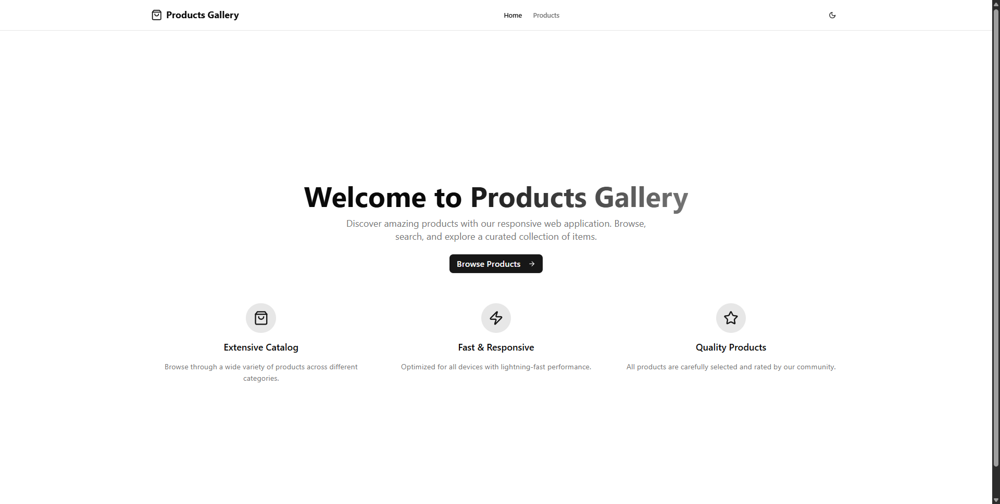
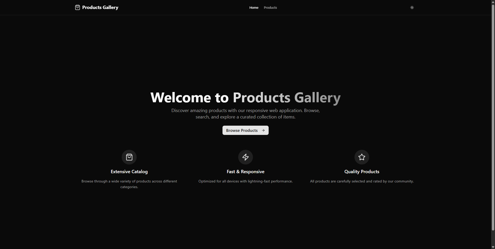
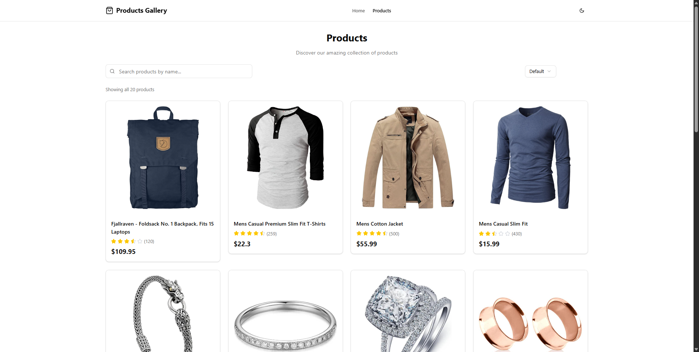
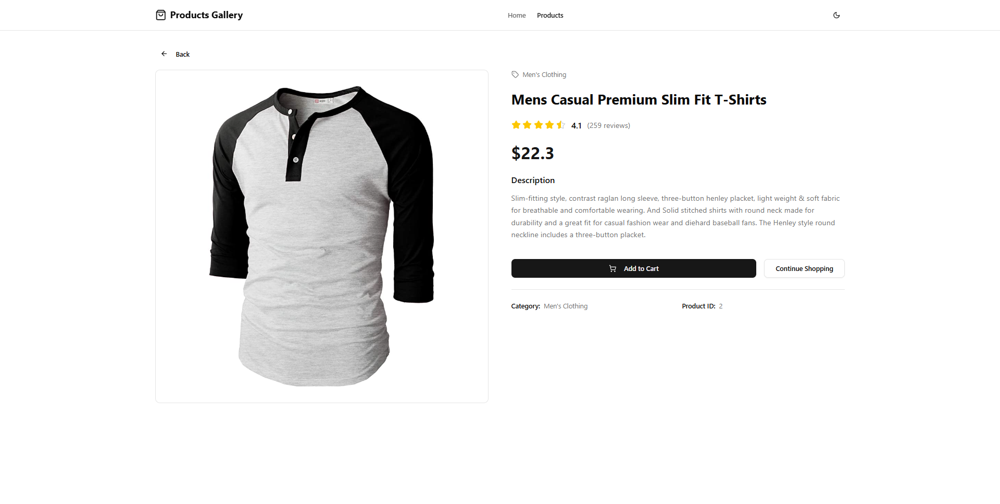

# Products Gallery Web Application

## Project Overview

The Products Gallery Web Application is a responsive and interactive platform built with React and JavaScript, designed to showcase a collection of products. It features dynamic data fetching from a third-party API, robust filtering and sorting capabilities, and detailed product views. The application prioritizes a modern, mobile-first UI design using Tailwind CSS, ensuring a seamless user experience across various devices. Key enhancements include a dark mode toggle and a clear product rating display.


To get a local copy up and running, follow these simple steps.

### Prerequisites

Make sure you have Node.js and npm (or pnpm) installed.

*   Node.js (v18 or higher)
*   npm (v9 or higher) or pnpm (v8 or higher)

### Installation

1.  Clone the repository:
    ```bash
    git clone https://github.com/vk0x65/RouteTSTask2025.git
    ```
2.  Navigate to the project directory:
    ```bash
    cd RouteTSTask2025
    ```
3.  Install dependencies:
    ```bash
    npm install ## or pnpm install
    ```

### Usage

To run the application in development mode:

```bash
npm run dev ## or pnpm run dev
```

Open your browser and visit `http://localhost:5173` to view the application.

## Screenshots or Demo









## Tech Stack Used

*   **Frontend**: React (v19.1), JavaScript
*   **Styling**: Tailwind CSS
*   **Routing**: React Router DOM
*   **State Management**: React Hooks (useState, useEffect, useContext)
*   **API Integration**: Fetch API
*   **Date Picker**: react-day-picker (v9.8.0) with date-fns (v3.6.0)
*   **UI Components**: Shadcn/ui, Radix UI
*   **Icons**: Lucide React
*   **Build Tool**: Vite
*   **Package Manager**: pnpm

## Developer Info
_Mostafa Mohamed (ALFY)_

__Route Academy C44__ 2025
